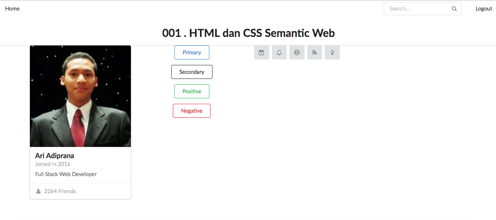

# :fire: 001 HTML dan CSS Semantic Web :fire:

## Description
This repository is built to fulfill the task from Hacktiv 8 coding bootcamp in phase 2.

This project is build using **Semantic UI**

### How to install
```shell
npm install
cd semantic/
gulp build
```
### Capture

